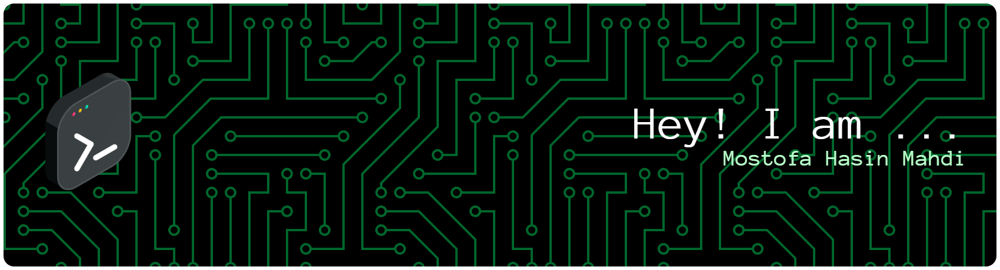

# 🚀 **Mostofa Hasin Mahdi**  
### **Backend Engineer | REST APIs | Databases | Scalable System Design**

### 🌐 **Connect With Me**

---

## 👨‍💻 **About Me**

I’m a **Backend Engineer** focused on building **reliable, scalable and maintainable backend systems** using  
**Express.js • FastAPI • PostgreSQL • MongoDB • MySQL**.

I love solving complex backend problems, designing efficient data pipelines, and building modern APIs that power real-world applications.

---

## ⚡ **Current Work & Interests**

- 💼 **Building:** A multi-tenant SaaS application  
- 🌱 **Learning:** Fundamentals of **Machine Learning** & backend architecture  
- 💬 **Ask me about:** FastAPI, Express.js, PostgreSQL, MongoDB, MySQL, Node.js, Python, C++, React, Flutter  

---

## 🛠️ **Tech Stack — Backend Focused**

### **Backend & APIs**

### **Databases**

### **Frontend (Supporting Skills)**

### **Programming Languages**

---

## 📈 **GitHub Stats**

---

## 🎯 **What I'm Focusing On Next**
- TypeScript for scalable backend codebases  
- Redis caching & message queues  
- Docker & CI/CD pipelines  
- System design principles  

---

⭐ *Thanks for visiting my profile! Always open to collaboration and exciting backend challenges.*
